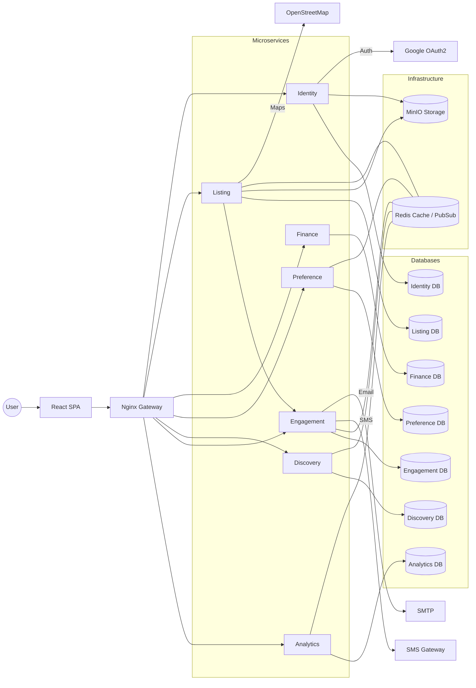
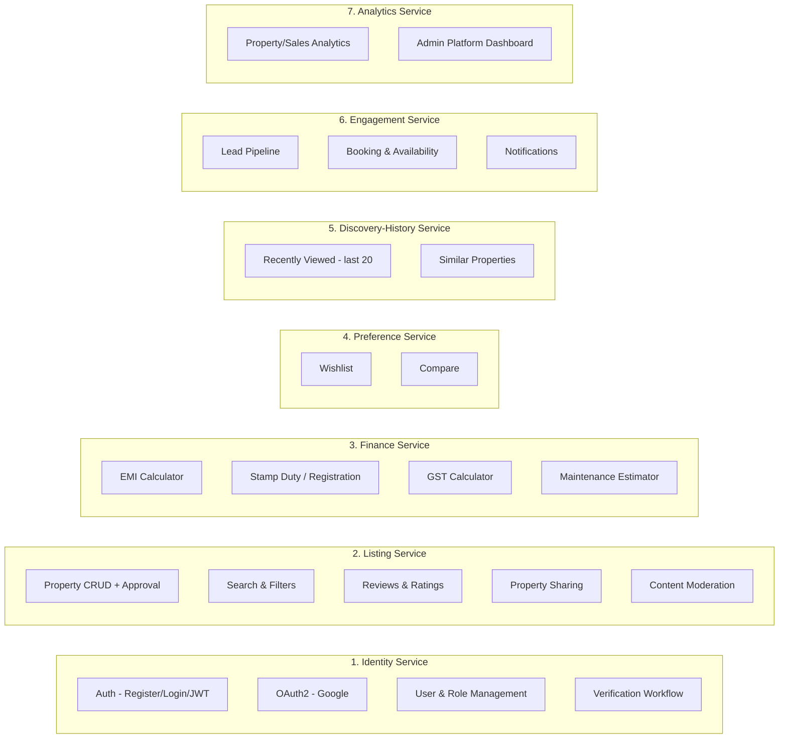
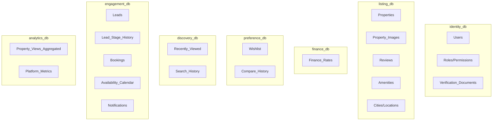
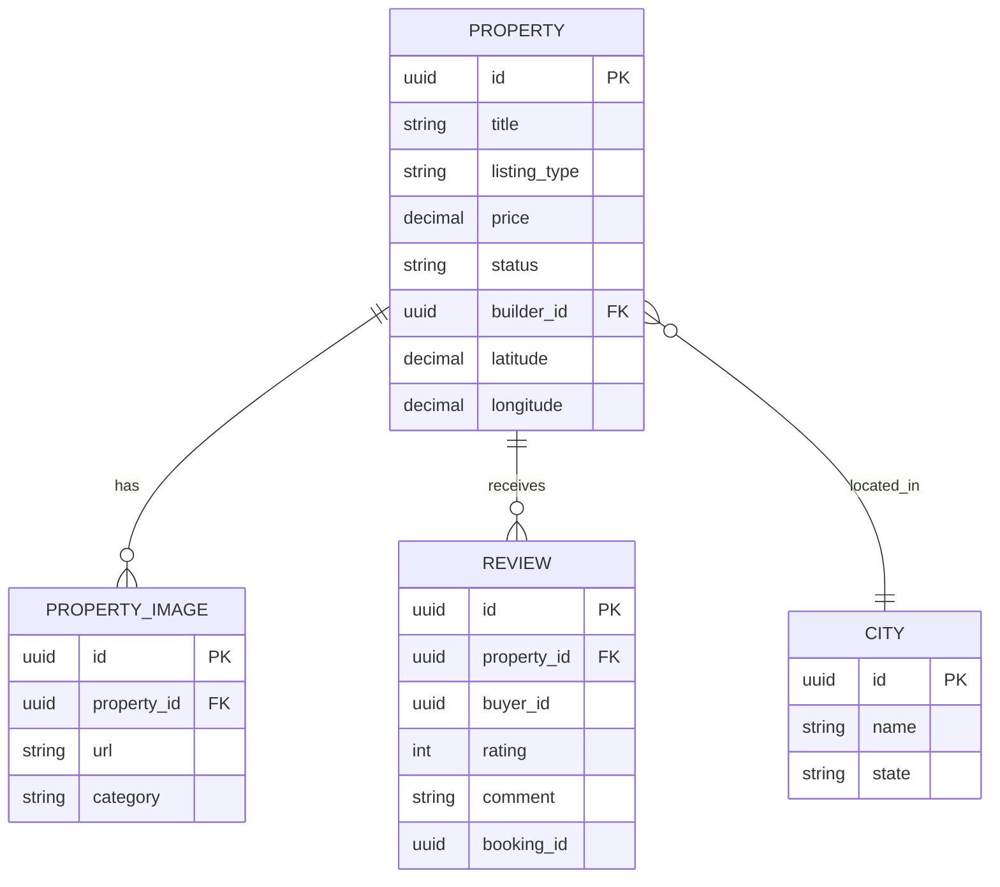
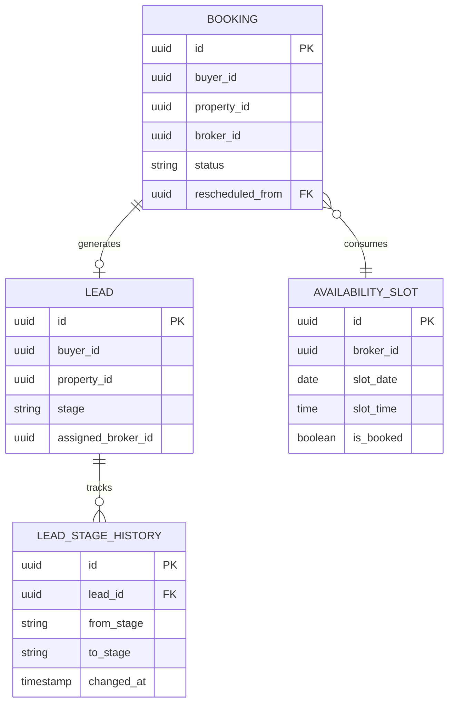
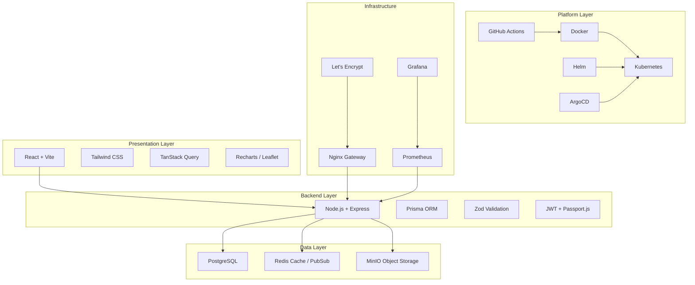
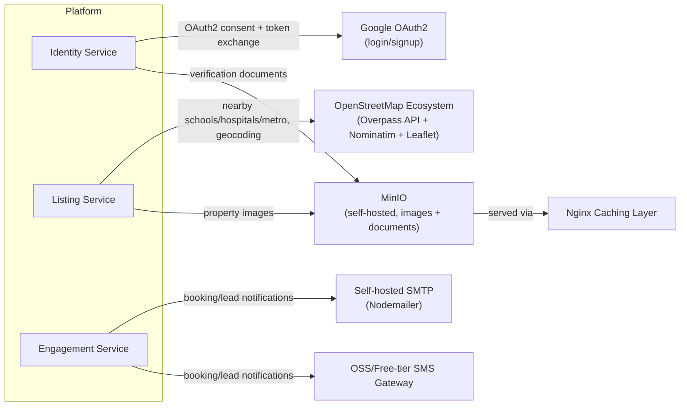
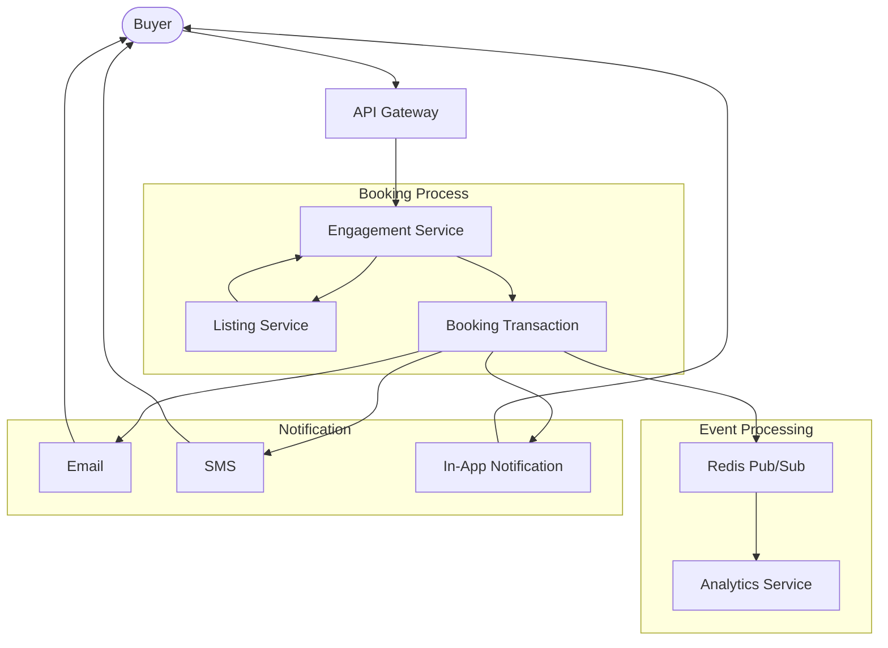
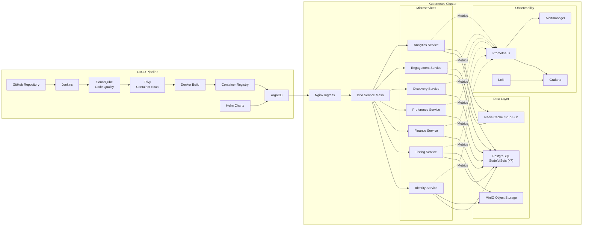

# High-Level Design (HLD) Document
## Real Estate Management & Property Discovery Platform

**Version:** 1.0
**Status:** Draft
**Prepared By:** Rohit
**Last Updated:** July 2026

---

## 1. Purpose

This HLD gives a visual, system-level view of the platform: how the 7 microservices fit together, how data flows through the system, what each service owns, and where external integrations plug in. Where the SRS specifies *requirements* (FR/NFR/API contracts), this document specifies *structure* — the shape of the system a developer or reviewer should hold in their head before diving into any one service.

---

## 2. Overall System Architecture

**Reading this diagram:** Each service has its own `db` node next to it — the **database-per-service** pattern (no service reaches into another's DB directly). Redis sits centrally, connected to every service that needs it as either a read cache or a Pub/Sub event bus. The Listing↔Engagement link at the bottom is the review-eligibility check called out in the SRS as a deliberate, explicit cross-service coupling — every other cross-service interaction flows through the gateway or Redis.

---

## 3. Modules & Services

### 3.1 Service Responsibility Summary

| Service | Primary Responsibility | Key Data Owned |
|---|---|---|
| **Identity** | Who the user is, what they're allowed to do | Users, Roles, Verification status |
| **Listing** | The source of truth for every property, its approval state, and its reputation (reviews) | Properties, Images, Reviews |
| **Finance** | Stateless money-math for buyers | Finance_Rates (config) |
| **Preference** | What a buyer likes / wants to compare | Wishlist, Compare_History |
| **Discovery-History** | What a buyer has seen and what to show them next | Recently_Viewed, Search_History |
| **Engagement** | Turning interest into a closed deal | Leads, Bookings, Availability, Notifications |
| **Analytics** | Making sense of what happened across the platform | Aggregated metrics (event-sourced) |

---

## 4. Database Overview

### 4.1 Database-per-Service Map

**Design principle:** No foreign keys cross a service/database boundary. Where one service needs to reference an entity owned by another (e.g., a Booking referencing a `property_id`), it stores the ID as a plain reference plus a denormalized snapshot of the fields it needs (see SRS Section 2.2) — not a DB-level FK, since PostgreSQL can't enforce a foreign key across two separate databases.

### 4.2 Core Entity Relationships (within Listing Service)

### 4.3 Core Entity Relationships (within Engagement Service)

---

## 5. Technology Stack

| Layer | Technology | Cost |
|---|---|---|
| Frontend | React + Vite, JavaScript (ES6+), Tailwind, shadcn/ui, TanStack Query, Recharts, Leaflet.js | Free/OSS |
| Backend (per service) | Node.js, Express.js, JavaScript, Prisma, Zod | Free/OSS |
| Auth | JWT, Passport.js (Google OAuth2), bcrypt | Free/OSS |
| Database | PostgreSQL (one per service) | Free/OSS |
| Cache & Events | Redis (cache + Pub/Sub) | Free/OSS |
| Storage | MinIO (self-hosted, S3-compatible) | Free/OSS — fully self-hosted, no vendor account |
| Maps | OpenStreetMap, Overpass API, Nominatim, Leaflet.js | Free/OSS |
| Containers & Orchestration | Docker, Kubernetes, Helm | Free/OSS |
| GitOps / CI | ArgoCD, GitHub Actions | Free/OSS |
| Gateway | Nginx | Free/OSS |
| Observability | Prometheus, Grafana | Free/OSS |
| TLS | Let's Encrypt | Free |

---

## 6. Integrations

| Integration | Used By | Purpose | Notes |
|---|---|---|---|
| Google OAuth2 | Identity Service | Social login/signup | Free to integrate; new users default to `Buyer` role |
| OpenStreetMap + Overpass API + Nominatim | Listing Service | Nearby infrastructure (schools/hospitals/metro), geocoding | Free alternative to paid Google Maps API |
| Self-hosted SMTP (Nodemailer) | Engagement Service | Email notifications | Best-effort channel; in-app remains guaranteed |
| OSS/free-tier SMS gateway | Engagement Service | SMS notifications | Best-effort channel; avoids paid Twilio/MSG91 |
| MinIO + Nginx caching | Listing Service, Identity Service | Image and document storage/delivery | Fully self-hosted, S3-compatible — no vendor account or egress cost |

---

## 7. Key Flow — Booking Sequence (Cross-Service)

> **Note:** `architecture-beta` doesn't model time-ordered messages the way a true sequence diagram does — the numbers in each node label preserve the step order shown below. For strict message-level timing (request/response arrows per call), see the sequence diagram already used in the SRS.

**Step order:** (1) Buyer submits a booking request → (2) Gateway routes it to the Engagement Service → (3) Engagement Service receives it → (4) Engagement Service calls Listing Service internally to snapshot property price/builder info → (5) Booking creation + Lead stage update happen as a single local DB transaction inside Engagement Service → (6) Engagement Service publishes a `booking.created` event to Redis → (7) Analytics Service consumes the event asynchronously and updates its aggregation tables → (8) Buyer is notified in-app (guaranteed) plus email/SMS (best-effort).

---

## 8. Deployment View

**Each service ships as its own Helm chart** (or a shared umbrella chart with per-service `values.yaml`), with its own ArgoCD `Application` manifest — meaning a rollback of the Analytics Service, for example, never touches the Listing or Engagement Service pods.

---

## 9. Summary

This HLD is the visual companion to the SRS's Section 2 (System Overview): 7 services, database-per-service, Redis doing double duty as cache and event bus, an Nginx gateway at the edge, and a GitOps deployment model via ArgoCD/Helm/Kubernetes. The next level of detail — per-service Low-Level Design (class/module structure, exact table schemas, detailed sequence diagrams for every flow) — would be the natural follow-up document if needed.
