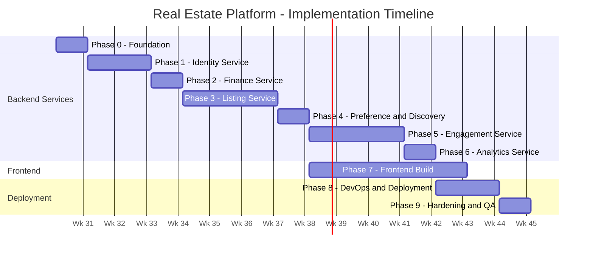

# Project Implementation Plan
## Real Estate Management & Property Discovery Platform

**Version:** 1.0
**Status:** Draft
**Prepared By:** Rohit
**Last Updated:** July 2026

---

## 1. Build Philosophy

- **Solo-developer, phased delivery** — one service reaches a working, tested state before the next begins in earnest. Not everything is built in parallel.
- **Service build order is deliberate, not alphabetical:** simplest/most-independent services first (to build momentum and validate the microservices pattern cheaply), most-coupled service (Engagement) only after the pattern is proven, Analytics last (it has nothing to consume until other services emit events).
- **Every phase ends with something demoable** — not just code that compiles, but a flow a reviewer could actually click through.
- Timeline totals **16 weeks**, matching the PRD's upper estimate (adjusted for microservices overhead vs. the original monolith estimate). Each week assumes realistic part-time/student-schedule effort, not full-time hours — pad rather than compress if DSA/coursework load is heavy that week.

---
## Folder Structure 
```
real-estate-platform/
│
├── memory.md                          # AI context file (read this first)
├── README.md                          # Project overview, setup instructions, architecture summary
├── docker-compose.yml                 # Boots all 7 service DBs + Redis + MinIO for local dev
├── .env.example                       # Template for required env vars (never commit real .env)
├── .gitignore
├── .eslintrc.json                     # Shared JS lint config across all services
├── .prettierrc
│
├── docs/                              # All planning/spec documents
│   ├── BRD_RealEstate_Platform.md
│   ├── PRD_RealEstate_Platform.md
│   ├── SRS_RealEstate_Platform.md
│   ├── HLD_RealEstate_Platform.md
│   ├── FRD_RealEstate_Platform.md
│   ├── UIUX_Documentation_RealEstate_Platform.md
│   ├── Implementation_Plan_RealEstate_Platform.md
│   └── DEPLOYMENT.md                  # Written in Phase 8 — ArgoCD sync process
│
├── services/
│   │
│   ├── identity-service/
│   │   ├── src/
│   │   │   ├── routes/
│   │   │   │   ├── auth.routes.js         # /auth/register, /login, /google, /refresh, /logout
│   │   │   │   └── verification.routes.js # /admin/verifications/*
│   │   │   ├── controllers/
│   │   │   │   ├── auth.controller.js
│   │   │   │   └── verification.controller.js
│   │   │   ├── services/
│   │   │   │   ├── jwt.service.js
│   │   │   │   ├── oauth.service.js       # Passport.js Google OAuth2
│   │   │   │   └── password.service.js    # bcrypt hashing
│   │   │   ├── middleware/
│   │   │   │   ├── auth.middleware.js     # JWT validation — copy-shared pattern across services
│   │   │   │   ├── rbac.middleware.js
│   │   │   │   └── rateLimit.middleware.js
│   │   │   ├── validators/                # Zod schemas
│   │   │   │   └── auth.validators.js
│   │   │   ├── app.js
│   │   │   └── server.js
│   │   ├── prisma/
│   │   │   ├── schema.prisma              # Users, Roles, Verification_Documents
│   │   │   └── migrations/
│   │   ├── tests/
│   │   │   ├── auth.test.js
│   │   │   └── verification.test.js
│   │   ├── Dockerfile
│   │   ├── .env.example
│   │   └── package.json
│   │
│   ├── listing-service/
│   │   ├── src/
│   │   │   ├── routes/
│   │   │   │   ├── property.routes.js
│   │   │   │   ├── search.routes.js
│   │   │   │   ├── review.routes.js
│   │   │   │   ├── share.routes.js
│   │   │   │   └── internal.routes.js     # /internal/properties/:id
│   │   │   ├── controllers/
│   │   │   ├── services/
│   │   │   │   ├── duplicateDetection.service.js
│   │   │   │   ├── imagePipeline.service.js  # Multer -> Sharp -> MinIO
│   │   │   │   ├── searchCache.service.js    # Redis caching for search
│   │   │   │   └── engagementClient.service.js # calls Engagement Service for review verification
│   │   │   ├── middleware/
│   │   │   ├── validators/
│   │   │   ├── app.js
│   │   │   └── server.js
│   │   ├── prisma/
│   │   │   ├── schema.prisma              # Properties, Property_Images, Reviews, Amenities, Cities
│   │   │   └── migrations/
│   │   ├── tests/
│   │   ├── Dockerfile
│   │   └── package.json
│   │
│   ├── finance-service/
│   │   ├── src/
│   │   │   ├── routes/
│   │   │   │   └── finance.routes.js      # /finance/emi, /stamp-duty, /gst, /registration, /maintenance
│   │   │   ├── controllers/
│   │   │   ├── services/
│   │   │   │   ├── emi.calculator.js
│   │   │   │   ├── stampDuty.calculator.js
│   │   │   │   ├── gst.calculator.js
│   │   │   │   └── maintenance.estimator.js
│   │   │   ├── app.js
│   │   │   └── server.js
│   │   ├── prisma/
│   │   │   ├── schema.prisma              # Finance_Rates
│   │   │   └── migrations/
│   │   ├── tests/                          # This service should have the highest test coverage — pure functions
│   │   ├── Dockerfile
│   │   └── package.json
│   │
│   ├── preference-service/
│   │   ├── src/
│   │   │   ├── routes/
│   │   │   │   └── preference.routes.js   # /wishlist/*, /compare
│   │   │   ├── controllers/
│   │   │   ├── services/
│   │   │   │   └── listingClient.service.js # resolves property data from Listing Service, cached
│   │   │   ├── app.js
│   │   │   └── server.js
│   │   ├── prisma/
│   │   │   ├── schema.prisma              # Wishlist, Compare_History
│   │   │   └── migrations/
│   │   ├── tests/
│   │   ├── Dockerfile
│   │   └── package.json
│   │
│   ├── discovery-history-service/
│   │   ├── src/
│   │   │   ├── routes/
│   │   │   │   ├── recentlyViewed.routes.js
│   │   │   │   ├── similarProperties.routes.js
│   │   │   │   └── internal.routes.js     # /internal/views
│   │   │   ├── controllers/
│   │   │   ├── services/
│   │   │   │   ├── viewLog.service.js     # capped-20, dedup logic
│   │   │   │   ├── similarityMatcher.service.js # rule-based V1 matching
│   │   │   │   └── listingClient.service.js
│   │   │   ├── app.js
│   │   │   └── server.js
│   │   ├── prisma/
│   │   │   ├── schema.prisma              # Recently_Viewed, Search_History
│   │   │   └── migrations/
│   │   ├── tests/
│   │   ├── Dockerfile
│   │   └── package.json
│   │
│   ├── engagement-service/
│   │   ├── src/
│   │   │   ├── routes/
│   │   │   │   ├── availability.routes.js
│   │   │   │   ├── booking.routes.js
│   │   │   │   ├── lead.routes.js
│   │   │   │   ├── notification.routes.js
│   │   │   │   └── internal.routes.js     # /internal/bookings/verify-completed
│   │   │   ├── controllers/
│   │   │   ├── services/
│   │   │   │   ├── bookingTransaction.service.js # atomic booking+slot+lead logic — most critical file in the repo
│   │   │   │   ├── leadStateMachine.service.js   # enforces sequential stage transitions
│   │   │   │   ├── notificationDispatcher.service.js # in-app + email(Nodemailer) + SMS
│   │   │   │   ├── eventPublisher.service.js     # Redis Pub/Sub publish
│   │   │   │   └── listingClient.service.js      # snapshot property data at booking time
│   │   │   ├── app.js
│   │   │   └── server.js
│   │   ├── prisma/
│   │   │   ├── schema.prisma              # Leads, Lead_Stage_History, Bookings, Availability_Calendar, Notifications
│   │   │   └── migrations/
│   │   ├── tests/
│   │   │   ├── booking.race-condition.test.js  # explicitly named per FRD UC-ES-02
│   │   │   ├── booking.reschedule.test.js
│   │   │   └── lead.state-machine.test.js
│   │   ├── Dockerfile
│   │   └── package.json
│   │
│   └── analytics-service/
│       ├── src/
│       │   ├── routes/
│       │   │   ├── propertyAnalytics.routes.js
│       │   │   ├── salesAnalytics.routes.js
│       │   │   └── platformAnalytics.routes.js
│       │   ├── controllers/
│       │   ├── services/
│       │   │   ├── eventSubscriber.service.js    # Redis Pub/Sub subscribe
│       │   │   └── aggregationJob.service.js     # scheduled, idempotent — see FRD UC-AS-02
│       │   ├── jobs/
│       │   │   └── aggregate.cron.js
│       │   ├── app.js
│       │   └── server.js
│       ├── prisma/
│       │   ├── schema.prisma              # pre-aggregated tables only
│       │   └── migrations/
│       ├── tests/
│       │   └── aggregation.idempotency.test.js  # re-run same batch, assert no double-count
│       ├── Dockerfile
│       └── package.json
│
├── frontend/
│   ├── src/
│   │   ├── pages/                         # one folder per Screen List ID (S-01 ... S-23)
│   │   │   ├── search/
│   │   │   ├── property-detail/
│   │   │   ├── auth/
│   │   │   ├── buyer-dashboard/
│   │   │   ├── compare/
│   │   │   ├── wishlist/
│   │   │   ├── my-bookings/
│   │   │   ├── builder-broker-dashboard/
│   │   │   ├── my-properties/
│   │   │   ├── property-editor/
│   │   │   ├── leads-kanban/
│   │   │   ├── availability-calendar/
│   │   │   ├── sales-analytics/
│   │   │   ├── admin-dashboard/
│   │   │   ├── verification-queue/
│   │   │   ├── moderation-queue/
│   │   │   ├── review-moderation/
│   │   │   ├── platform-analytics/
│   │   │   ├── finance-suite/
│   │   │   └── profile-settings/
│   │   ├── components/
│   │   │   ├── ui/                        # shadcn/ui primitives (Card, Badge, Sheet, Tabs, Dialog...)
│   │   │   ├── PropertyCard/
│   │   │   ├── StatusBadge/
│   │   │   ├── FilterPanel/
│   │   │   ├── FinanceCalculatorTabs/
│   │   │   ├── ScheduleVisitPicker/
│   │   │   ├── LeadKanbanCard/
│   │   │   ├── DataTable/
│   │   │   ├── ChartContainer/
│   │   │   └── EmptyState/
│   │   ├── hooks/                         # TanStack Query hooks per service
│   │   │   ├── useProperties.js
│   │   │   ├── useAuth.js
│   │   │   ├── useBookings.js
│   │   │   └── useAnalytics.js
│   │   ├── lib/
│   │   │   ├── apiClient.js                # base fetch wrapper pointing at API Gateway
│   │   │   └── queryClient.js
│   │   ├── styles/
│   │   │   ├── tokens.css                  # design system CSS custom properties (light + dark theme)
│   │   │   └── tailwind.config.js
│   │   ├── App.jsx
│   │   └── main.jsx
│   ├── public/
│   ├── index.html
│   ├── vite.config.js
│   └── package.json
│
├── infra/
│   ├── gateway/
│   │   └── nginx.conf                     # path-based routing to all 7 services
│   │
│   ├── helm/
│   │   ├── base-chart/                    # shared template (built from Finance Service in Phase 2)
│   │   │   ├── templates/
│   │   │   │   ├── deployment.yaml
│   │   │   │   ├── service.yaml
│   │   │   │   ├── configmap.yaml
│   │   │   │   └── hpa.yaml
│   │   │   └── Chart.yaml
│   │   ├── identity-service/
│   │   │   └── values.yaml
│   │   ├── listing-service/
│   │   │   └── values.yaml
│   │   ├── finance-service/
│   │   │   └── values.yaml
│   │   ├── preference-service/
│   │   │   └── values.yaml
│   │   ├── discovery-history-service/
│   │   │   └── values.yaml
│   │   ├── engagement-service/
│   │   │   └── values.yaml
│   │   ├── analytics-service/
│   │   │   └── values.yaml
│   │   └── frontend/
│   │       └── values.yaml
│   │
│   ├── argocd/
│   │   ├── identity-service.application.yaml
│   │   ├── listing-service.application.yaml
│   │   ├── finance-service.application.yaml
│   │   ├── preference-service.application.yaml
│   │   ├── discovery-history-service.application.yaml
│   │   ├── engagement-service.application.yaml
│   │   ├── analytics-service.application.yaml
│   │   └── frontend.application.yaml
│   │
│   ├── k8s/
│   │   ├── namespaces.yaml                # gateway / services / data / monitoring
│   │   └── minio/
│   │       └── minio-statefulset.yaml
│   │
│   └── monitoring/
│       ├── prometheus/
│       │   └── prometheus.yml
│       └── grafana/
│           └── dashboards/
│               ├── service-latency.json
│               └── error-rate.json
│
├── .github/
│   └── workflows/
│       ├── lint-and-test.yml              # runs on every PR
│       └── build-and-push.yml             # builds+pushes Docker images on merge to main
│
└── scripts/
    ├── seed-finance-rates.js              # seeds Finance_Rates for at least 5 states (Phase 2)
    └── setup-local-env.sh                 # one-shot local bootstrap script
```
---

### Notes on Key Structural Decisions

services/*/src/services/*Client.service.js naming pattern — every file that calls another microservice is named xClient.service.js (e.g., listingClient.service.js inside Preference Service). This makes cross-service dependencies grep-able in one command (grep -r "Client.service.js" services/) — matches the HLD's explicit cross-service dependency table.
bookingTransaction.service.js is called out in the tree comment as "the most critical file in the repo" deliberately — it's where the FR-BOOK-02 atomic transaction (booking + slot lock + lead update) lives, and it's the single place a bug would cause real data corruption (double-booked slots).
Test files named after their FRD use case (booking.race-condition.test.js, aggregation.idempotency.test.js) rather than generic booking.test.js — makes it obvious in CI output exactly which documented edge case failed, and ties every test back to the FRD without needing a separate traceability spreadsheet.
infra/helm/base-chart/ exists because Finance Service (Phase 2, the first fully Dockerized+Helm-charted service per the Implementation Plan) becomes the template every other service's values.yaml is copied from — one chart, many values files, not seven separate charts.
frontend/src/pages/ folder names map 1:1 to the Screen List (Section 5) in the UI/UX Documentation — anyone can find a screen's code by looking up its S-ID there.
---

## 2. Phase 0 — Foundation & Environment (Week 1)

**Goal:** Every tool in the OSS stack runs locally before a single feature is written.

- [x] Install Docker + Docker Compose, verify with a hello-world container
- [x] Set up local Kubernetes (Minikube or KillerCoda) for later deployment-realistic testing
- [x] Create GitHub repo with monorepo structure (`/services/identity`, `/services/listing`, etc., `/frontend`, `/infra/helm`, `/infra/k8s`)
- [x] Set up shared PostgreSQL + Redis + MinIO via a root `docker-compose.yml` (all 7 service DBs as separate containers/databases)
- [x] Verify MinIO console accessible locally, create a test bucket
- [x] Set up Prisma in one service as a proof of connection to its dedicated DB
- [x] Set up ESLint + Prettier config shared across services (JavaScript, not TypeScript per stack decision)
- [x] Write root `README.md` with architecture summary + links to BRD/PRD/SRS/HLD/FRD docs
- [x] Set up GitHub Actions skeleton (lint + test job, even if tests are empty initially)
- [x] Create Postman collection skeleton for manual API testing across services

**Milestone:** `docker-compose up` boots the full data layer (7 Postgres DBs + Redis + MinIO) with zero errors.

---

## 3. Phase 1 — Identity Service (Weeks 2-3)

**Goal:** Every other service can trust a JWT by the end of this phase.

### Week 2 — Core Auth
- [x] Design `identity_db` schema in Prisma (Users, Roles, Verification fields per SRS Section 8.1)
- [x] Implement `POST /auth/register` (FR-AUTH-01) with bcrypt hashing
- [x] Implement `POST /auth/login` issuing JWT access + refresh token pair (FR-AUTH-02)
- [x] Implement JWT middleware (validates signature + expiry, attaches `user`/`role` to request) — reusable, will be copy-shared across all services
- [x] Implement `POST /auth/refresh` with rotation (FR-AUTH-07, SEC-02)
- [x] Write unit tests for password hashing, JWT issuance, and rotation edge case (UC-ID-03)

### Week 3 — OAuth2, Roles & Verification
- [x] Implement Google OAuth2 flow via Passport.js (FR-AUTH-03, UC-ID-02)
- [x] Implement RBAC middleware (role-check decorator/wrapper) (SEC-03)
- [x] Build Verification submission endpoint + MinIO document upload (UC-ID-04)
- [x] Build Admin verification approve/reject endpoints + audit logging (UC-ID-05, FR-USER-05)
- [x] Rate-limit `/auth/login` and `/auth/register` (SEC-05)
- [x] Write Postman collection covering every Identity Service endpoint from the SRS API spec

**Milestone:** Can register, login (email + Google), get a valid JWT, and an Admin can verify a test Builder account — fully demoable via Postman, no frontend yet.

---

## 4. Phase 2 — Finance Service (Week 4)

**Goal:** Simplest service in the system — deliberately scheduled early to prove the multi-service pattern (own repo/DB/container/Helm chart) cheaply before tackling anything harder.

- [x] Design `finance_db` schema (`Finance_Rates` table, state-wise seeded data for at least 5 major states)
- [x] Implement EMI calculation endpoint (FR-FIN-01, UC-FS-01)
- [x] Implement Stamp Duty + Registration Cost endpoints, reading from `Finance_Rates` (FR-FIN-02, UC-FS-02)
- [x] Implement GST endpoint with construction-status logic (FR-FIN-03)
- [x] Implement Maintenance Estimator endpoint (FR-FIN-04)
- [x] Implement Rent Affordability endpoint (FR-FIN-05)
- [x] Implement Admin-only rate update endpoint (FR-FIN-06, UC-FS-03)
- [x] Unit tests for every calculator against known correct outputs (this is pure-function logic — should be the best-tested service in the system)
- [x] Dockerize + write its first Helm chart (template for the other 6)

**Milestone:** All 5 calculators return correct values via Postman; this service's Helm chart becomes the copy-paste starting point for every other service's chart.

---

## 5. Phase 3 — Listing Service (Weeks 5-7)

**Goal:** The core of the platform — property lifecycle, search, reviews, sharing.

### Week 5 — Property CRUD & Lifecycle
- [x] Design `listing_db` schema (Properties, Property_Images, Reviews, Amenities, Cities — per HLD ER diagram)
- [x] Implement Draft creation + 30s autosave (FR-PROP-01, FR-PROP-02, UC-LS-01)
- [x] Implement Submit-for-review transition + duplicate-detection check (FR-PROP-03, FR-PROP-06, UC-LS-02)
- [x] Implement Admin approve/reject endpoints with reason enum (FR-PROP-04, FR-PROP-05, UC-LS-03, UC-LS-04)
- [x] Enforce owner-verification check at approval time (cross-check against Identity Service)
- [x] Implement image upload pipeline: Multer → Sharp (resize/compress) → MinIO (FR-PROP-07 image fields)

### Week 6 — Search & Discovery
- [x] Implement filtered search endpoint with proper PostgreSQL indexes (FR-SEARCH-01)
- [x] Wire Redis caching for search results, keyed by normalized filter combo, 5-min TTL (FR-SEARCH-03)
- [x] Implement cache invalidation on property status/field changes (FR-SEARCH-04)
- [x] Build Rental vs Sale listing-type fields and conditional validation (Listing_Type scope from PRD Section 5.2)
- [x] Implement `/internal/properties/:id` for other services to consume (HLD cross-service dependency)

### Week 7 — Reviews & Sharing
- [x] Implement review submission with booking validation (UC-LS-06)
- [x] Implement review reply + Admin moderation endpoints (FR-REV-03, FR-REV-04)
- [x] Write integration/unit tests for property lifecycle
- [x] Configured with self-hosted MinIO object storage (`http://localhost:9000/gharsetu-listings`)

**Milestone:** Can create, submit, approve, and publicly search a property end-to-end; a guest can view it and calculate EMI on it (calls Finance Service) without logging in.

---

## 6. Phase 4 — Preference & Discovery-History Services (Week 8)

**Goal:** Two small, similar-shaped services — batched into one week since both are thin reference-storage layers over Listing Service data.

- [x] Preference Service: `preference_db` schema (Wishlist, Compare_History)
- [x] Preference Service: Add/remove wishlist endpoints (FR-WISH-01, UC-PS-01)
- [x] Preference Service: Compare endpoint (max 4, resolves via Listing Service `/internal/properties`) (FR-WISH-02, UC-PS-02)
- [x] Discovery-History Service: `discovery_db` schema (Recently_Viewed capped-20 log, Search_History)
- [x] Discovery-History Service: `/internal/views` logging endpoint (FR-REC-01, FR-REC-02, UC-DH-01)
- [x] Discovery-History Service: Similar Properties rule-based matching (FR-REC-03, FR-REC-04, UC-DH-02)
- [x] Wire Redis caching (2-min TTL) for both services' property-data lookups against Listing Service
- [ ] Dockerize + Helm charts for both

**Milestone:** A logged-in buyer can wishlist, compare 4 properties, and see "Recently Viewed" populate automatically after browsing.

---

## 7. Phase 5 — Engagement Service (Weeks 9-11)

**Goal:** The most transactionally sensitive service in the system — scheduled after the pattern is well-proven elsewhere, given its complexity.

### Week 9 — Availability & Booking Core
- [ ] Design `engagement_db` schema (Leads, Lead_Stage_History, Bookings, Availability_Calendar, Notifications)
- [ ] Implement Availability Calendar CRUD for Broker/Builder (FR-BOOK-01, UC-ES-01)
- [ ] Implement booking creation with the critical atomic transaction: create booking + lock slot + create/update lead, all in one DB transaction (FR-BOOK-02, FR-LEAD-01, UC-ES-02)
- [ ] Write a specific test for the race-condition case: two simultaneous booking requests for the same slot (must reject one cleanly, per UC-ES-02 alternate flow)

### Week 10 — Cancel/Reschedule, Leads
- [ ] Implement cancel booking endpoint (FR-BOOK-03)
- [ ] Implement reschedule endpoint with atomic slot-release + new-booking-create (FR-BOOK-04, UC-ES-03) — write the specific test for "reschedule target slot also unavailable" edge case
- [ ] Implement Lead stage-machine transitions with sequential-only enforcement (FR-LEAD-02, FR-LEAD-03, UC-ES-04)
- [ ] Implement `Lead_Stage_History` append-only logging (FR-LEAD-04)
- [ ] Replace the temporary Listing-Service stub from Phase 3 with the real `/internal/bookings/verify-completed` endpoint (FR-REV-01 dependency, closes the loop from Week 7)

### Week 11 — Notifications
- [ ] Set up self-hosted SMTP via Nodemailer (or free-tier SMTP relay) (FR-NOTIF-02)
- [ ] Set up OSS/free-tier SMS gateway integration (FR-NOTIF-03)
- [ ] Implement in-app Notifications table + endpoint as the guaranteed channel (FR-NOTIF-01)
- [ ] Wire all three channels to fire on booking create/cancel/reschedule — confirm failures in email/SMS never block the core action (FR-NOTIF-04)
- [ ] Publish `booking.created`, `booking.completed`, `lead.stage_changed` events to Redis Pub/Sub (for Analytics Service, Phase 6)
- [ ] Dockerize + Helm chart

**Milestone:** A buyer can book, get cancelled/rescheduled correctly under concurrent load, a lead auto-updates, and the buyer can now leave a review on Listing Service because the real verification endpoint is live.

---

## 8. Phase 6 — Analytics Service (Week 12)

**Goal:** Last, by design — it has nothing to consume until the other services are emitting real events.

- [ ] Design `analytics_db` schema (pre-aggregated tables, not raw event mirrors)
- [ ] Implement Redis Pub/Sub subscriber consuming events from Listing + Engagement Services (FR-ANLY-01)
- [ ] Implement scheduled aggregation job (cron), built idempotent from day one (UC-AS-02 — do not skip this, it's flagged as a hard requirement in the FRD)
- [ ] Implement Builder-facing chart endpoints: Views/Leads/Conversion-funnel/Revenue (FR-ANLY-02, UC-AS-01)
- [ ] Implement Admin platform-wide dashboard endpoint (FR-ANLY-03, UC-AS-03)
- [ ] Write a test that re-runs the aggregation job twice on the same event batch and asserts no double-counting (directly testing the idempotency requirement)
- [ ] Dockerize + Helm chart

**Milestone:** A Builder can see real view/lead/booking numbers reflecting actual activity generated in Phases 3-5; an Admin can see platform-wide numbers.

---

## 9. Phase 7 — Frontend Build (Weeks 9-13, run in parallel with Phases 5-6 backend work)

**Goal:** React SPA consuming all 7 services through the Gateway. Scheduled to overlap with backend weeks 9-13 rather than strictly after, since Phases 1-4's services are already usable by the frontend from Week 8 onward.

- [ ] Set up React + Vite project, Tailwind, shadcn/ui, TanStack Query
- [ ] Build design tokens from UI/UX Documentation Section 8 (colors, type scale, spacing) as a Tailwind config extension
- [ ] Build shared component library per UI/UX Documentation Section 9 (Property Card, Status Badge, Filter Panel, etc.)
- [ ] Build S-01 Home/Search + S-02 Property Detail (including inline Finance Suite) — **guest-accessible, no login required**, per Section 3/11 of PRD
- [ ] Build S-03 Login/Register (email + Google OAuth2)
- [ ] Build S-04 Buyer Dashboard, S-05 Compare, S-06 Wishlist, S-07 Schedule Visit, S-08 My Bookings, S-09 Review modal
- [ ] Build S-10 Verification Submission, S-11 Broker/Builder Dashboard, S-12 My Properties, S-13 Property Editor (multi-step, autosave)
- [ ] Build S-14 Leads Kanban (with mobile "Move to..." fallback per Responsive Rules)
- [ ] Build S-15 Availability Calendar, S-16 Sales Analytics (Recharts)
- [ ] Build S-17 through S-21 Admin screens (Dashboard, Verification Queue, Moderation Queue, Review Moderation, Platform Analytics)
- [ ] Implement empty/loading/error states per UI/UX Documentation Section 11 across all screens (not just happy paths)
- [ ] Accessibility pass against UI/UX Documentation Section 12 checklist (contrast, keyboard nav, aria-live toasts, reduced-motion)
- [ ] Responsive QA pass at all 3 breakpoints (Section 10)

**Milestone:** Every screen in the Screen List is clickable end-to-end against real backend services, not mocked data.

---

## 10. Phase 8 — DevOps, Deployment & Observability (Weeks 14-15)

- [ ] Finalize Helm charts for all 7 services (shared base chart + per-service `values.yaml`)
- [ ] Set up Nginx API Gateway with path-based routing to all 7 services (HLD Section 2.3)
- [ ] Deploy full stack to local/free-tier Kubernetes cluster
- [ ] Set up ArgoCD, connect to Git repo, configure one `Application` per service (independent deployability, NFR-14)
- [ ] Set up GitHub Actions CI: lint + test on every PR, build+push Docker images on merge to main
- [ ] Set up Prometheus + Grafana, wire basic dashboards (request latency, error rate per service)
- [ ] Set up Let's Encrypt TLS via Certbot for the deployed domain
- [ ] Load-test the search endpoint to validate the < 200ms cached / < 800ms cold targets (NFR-01, NFR-02)
- [ ] Test independent rollback: intentionally break one service's deploy, confirm others remain unaffected (validates NFR-14 for real, not just on paper)
- [ ] Write a `DEPLOYMENT.md` documenting the ArgoCD sync process for future reference

**Milestone:** Platform is live on a real (free-tier) URL with HTTPS, monitored, and each service independently redeployable via a Git push.

---

## 11. Phase 9 — Hardening, QA & Portfolio Polish (Week 16)

- [ ] Full regression pass against every FR-ID in the SRS (spot-check, not exhaustive re-test of everything already covered by Phase-level tests)
- [ ] Security pass against every SEC-ID in the SRS (SEC-01 through SEC-12 checklist)
- [ ] Fix any remaining empty/loading/error state gaps found during QA
- [ ] Record a demo walkthrough video covering all 4 personas' key flows (useful for interviews/portfolio, not just internal QA)
- [ ] Write the project's public-facing `README.md` (architecture diagram embed, tech stack, setup instructions, link to live demo)
- [ ] Prepare a PSTAR-framework explanation of the 3 hardest engineering decisions made (booking-slot atomicity, idempotent aggregation, review cross-service verification) — for interview use, per established interview-prep pattern
- [ ] Tag a `v1.0` release in Git

**Milestone:** Project is portfolio-ready — live, documented, defensible in a technical interview walkthrough.

---

## 12. Timeline Summary

| Week | Phase | Focus |
|---|---|---|
| 1 | Phase 0 | Environment & tooling foundation |
| 2-3 | Phase 1 | Identity Service |
| 4 | Phase 2 | Finance Service |
| 5-7 | Phase 3 | Listing Service |
| 8 | Phase 4 | Preference + Discovery-History Services |
| 9-11 | Phase 5 | Engagement Service |
| 9-13 | Phase 7 (parallel) | Frontend build |
| 12 | Phase 6 | Analytics Service |
| 14-15 | Phase 8 | DevOps, deployment, observability |
| 16 | Phase 9 | Hardening, QA, portfolio polish |



---

## 13. Suggested MVP Cut (If 16 Weeks Isn't Available)

If timeline pressure hits (exams, other coursework), cut in this order — each cut preserves a demoable product, just a smaller one:

1. Drop Analytics Service's Admin platform dashboard (UC-AS-03) — keep Builder-facing analytics only
2. Drop Rental listing type — Sale-only for v1 (Section 5.2 scope reduction)
3. Drop Compare and Similar Properties (Preference/Discovery-History reduced to Wishlist + Recently Viewed only)
4. Drop SMS notifications — Email + in-app only
5. Drop Reviews & Ratings entirely (removes the Listing↔Engagement cross-service coupling too — simplifies Phase 3/5)
6. **Never cut:** Booking atomicity/race-condition handling, RBAC/verification gating, or the DevOps/deployment phase — these are the parts that actually demonstrate the skills this project exists to prove.